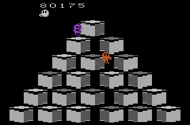

# Q*bert Learner

An agent capable of learning to play the game of Q*bert designed for ECSE-526 Artificial Intelligence.

# Usage

To compile the agent program, run the `make` command from the top-level directory. This will generate the `agent.exe` program. Note that this requires the [Arcade Learning Environment](https://github.com/mgbellemare/Arcade-Learning-Environment) to be installed, and only the `g++` compiler is supported.

To run the agent program, execute `./agent.exe`. This will run the subsumption-v2 agent with an inverse_proportional exploration policy and a seed of 123. To change the seed, use the `-s <random_seed>` argument. For a full list of possible arguments, use the `-h` flag.

The learning parameters for each (agent, exploration policy) pair are stored in the `params/` directory. These parameters are loaded on start-up and saved after every episode. In addition, the results of a run are stored in the `results/` directory. To reset the agent's utilities, simply delete the corresponding parameter files.
